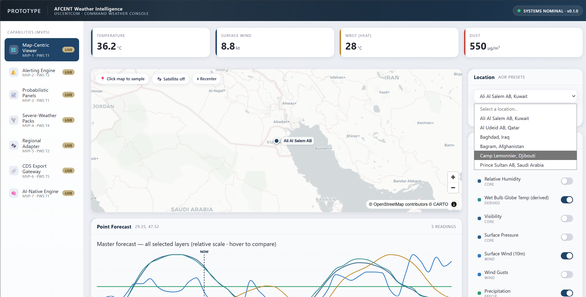
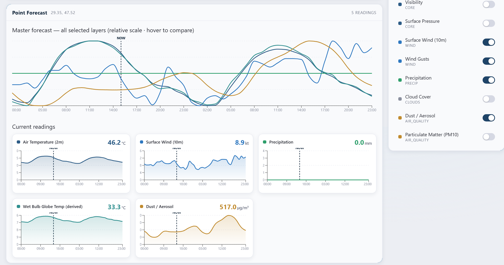
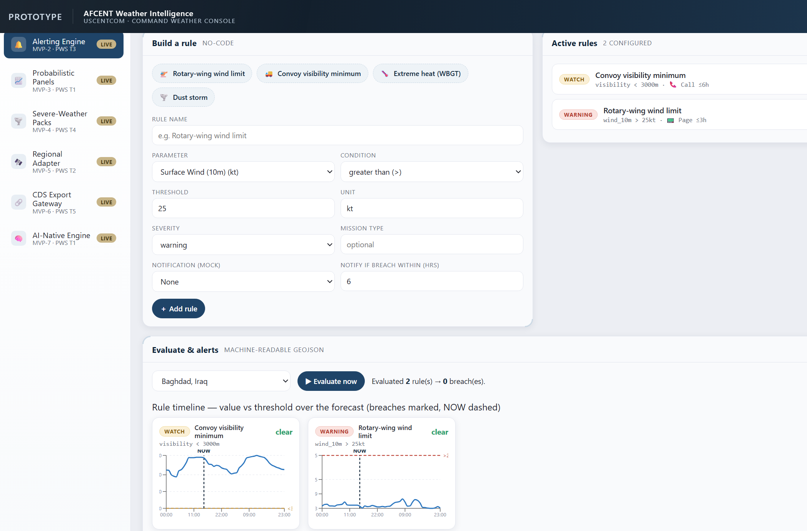
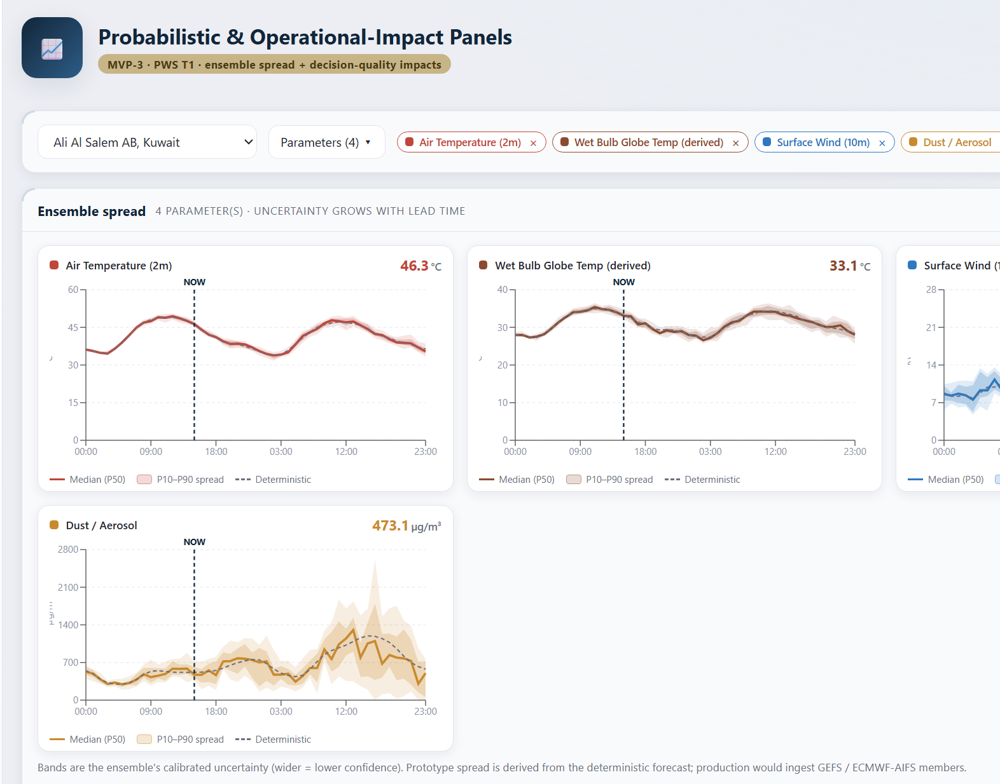
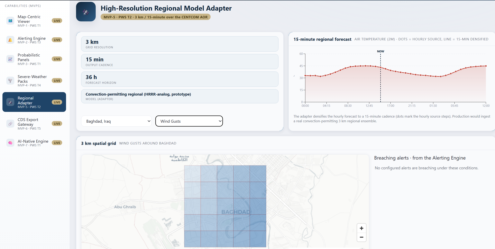

# AFCENT Weather Intelligence SaaS — Prototype

A locally-runnable prototype of the **U.S. Department of Defense (DoD) - AFCENT / USCENTCOM Weather Intelligence platform** (solicitation FA480326Q0096). **All seven MVPs are implemented end-to-end** — each has a real FastAPI router, a service module, an acceptance test suite and a page in the UI — so the foundation demonstrably integrates with every capability described in the architecture document
([`docs/AFCENT-Weather-Intelligence-Prototype-Architecture.html`](docs/AFCENT-Weather-Intelligence-Prototype-Architecture.html)).

Where a capability needs infrastructure that cannot exist on a laptop (proprietary AI-NWP on GPU, a real Cross-Domain Solution, 3 km convection-permitting ensembles), the prototype implements the **full contract and UI** and derives the values from free public data — see §7 for exactly what is real and what is represented.

The stack is intentionally the one from that document and is built to be **containerised onto AWS EC2** later with minimal change.

* **Frontend:** React 18 + TypeScript + Vite, MapLibre GL, Recharts, TanStack Query, Zustand
* **API layer:** Python + FastAPI (routing per MVP)
* **Database:** SQLite (engine-isolated so it can become PostgreSQL / MS SQL / Oracle)

---

## 🎥 Demo

**[▶ Watch the 2-minutes demo (weather-intelligence-demo-v1.0.mp4
)](https://github.com/Shivalikch/weather-Intelligence/releases/tag/v1.0.0)**

A short walkthrough of the implemented weather-intelligence capabilities and user interface.

---

## 🖥️ Application Showcase

The prototype provides a map-centric operational interface with dedicated views for point forecasting, rule-based alerting, probabilistic forecasting, and regional weather adaptation.

### Map-Centric Weather Intelligence



The primary operational view provides the AOR map, weather layers, locations, forecast information and operational indicators.

### Point Forecast



Point-level forecast information integrated into the map-centric operational workflow.

### No-Code Alerting



A rule-based alerting interface for defining and evaluating operational weather thresholds.

### Probabilistic Forecasting



Probabilistic forecast and impact information presented through the operational interface.

### Regional Weather Adapter



Regional high-resolution forecast adaptation and visualization.

---

## 1. Architecture & plumbing

```text
                           ┌──────────────────────────────────────────────┐
    Browser (NIPRNet)      │                FRONTEND (Vite)               │
    http://localhost:5173  │  React + TS · MapLibre map · layer toggles   │
                           │  KPI tiles · forecast chart · MVP nav        │
                           │  ALL endpoints -> src/api/endpoints.ts       │
                           └───────────────┬──────────────────────────────┘
                                           │  /api/*  (Vite dev proxy)
                                           ▼
                           ┌──────────────────────────────────────────────┐
                           │              API LAYER (FastAPI)              │
                           │  main.py -> /health, /api/config,            │
                           │             /api/external-apis               │
                           │  api/route/*.py -> one router per MVP        │
                           │  services/*.py  -> one service per MVP       │
                           │  services/external_client.py -> outbound data│
                           │  (NO database driver imported here)          │
                           └───────┬───────────────────────┬──────────────┘
                                   │ data_access functions  │ httpx
                                   ▼                         ▼
               ┌──────────────────────────────┐   ┌───────────────────────────┐
               │        DATABASE LAYER        │   │   External data sources   │
               │  database/database.py        │   │  Open-Meteo, NASA GIBS,   │
               │    (only engine-specific file)│   │  NOAA, ECMWF, Copernicus… │
               │  database/data_access.py     │   │  (defined in external_api │
               │    (all parameterised SQL)   │   │   table, not hard-coded)   │
               │  SQLite: weatherman.db       │   └───────────────────────────┘
               └──────────────────────────────┘
```

**Key design rules enforced in the code**

1. **Database technology is isolated.** Only `backend/database/database.py` knows the engine (SQLite today). To switch to Oracle / MS SQL / PostgreSQL, change that one file (connection + paramstyle) — nothing else.
2. **All SQL lives in `backend/database/data_access.py`** as constant, **parameterised** statements. Values are always bound (`?` placeholders), never string-concatenated → no SQL injection. Routes/services call `data_access` functions and never write SQL.
3. **The API layer is DB-agnostic.** Nothing under `backend/api/` imports a database driver (there is an integration test that fails the build if it does).
4. **External calls are data-driven.** Every source is a row in the `external_api` table; `services/external_client.py` reads a row then makes the call. Registration/auth metadata lives with the row, as does the `mvp` column (which MVPs source from it) — so the UI's per-MVP **Data Sources** panel is generated from the table, never hard-coded (see §8).
5. **One router per MVP** under `backend/api/route/`; `main.py` only holds meta endpoints (health/config/catalogue) and mounts the routers.
6. **Frontend endpoints are centralised** in `frontend/src/api/endpoints.ts`.
7. **Only `external_client` reaches the network.** Routes and the other services call it rather than using `httpx` directly, which is what lets the whole suite run offline by mocking one function (`_http_get_json`).

### Folder structure

```text
Code/
├─ README.md                         ← this file
├─ .vscode/launch.json              ← debug configs (backend, pytest, frontend, full-stack)
├─ docs/
│  ├─ images/                       ← README application screenshots
│  │  ├─ 01-map-centric.png
│  │  ├─ 02-map-centric-point-forecast.png
│  │  ├─ 03-alert-rule.png
│  │  ├─ 04-probabilistic.png
│  │  └─ 05-regional-adapter.png
│  ├─ AFCENT-Weather-Intelligence-Prototype-Architecture.html
│  │                                 ← architecture & technology analysis (open in a browser)
│  ├─ external-apis.md               ← external data-source catalogue (open/registration)
│  └─ api-endpoints.md               ← this application's API reference
├─ backend/
│  ├─ .env.example                   ← app + DB connection config template
│  ├─ requirements.txt
│  ├─ pytest.ini · conftest.py
│  ├─ config.py                      ← settings loaded from .env
│  ├─ main.py                        ← FastAPI app: health, config, external-apis, router mounts
│  ├─ api/
│  │  ├─ schemas.py                  ← Pydantic models
│  │  └─ route/                      ← one router per MVP (all implemented)
│  │     ├─ forecast.py              ← MVP-1  /api/aor · /layers · /locations · /forecast
│  │     ├─ alerts.py                ← MVP-2  /api/alerts · /rules · /evaluate
│  │     ├─ probabilistic.py         ← MVP-3  /api/probabilistic/ensemble · /impact
│  │     ├─ severe.py                ← MVP-4  /api/severe/packs · /detections
│  │     ├─ regional.py              ← MVP-5  /api/regional/forecast · /grid
│  │     ├─ integration.py           ← MVP-6  /api/integration/cds/preview · /cds/export
│  │     └─ model.py                 ← MVP-7  /api/model/status · /predict
│  ├─ services/                      ← one service per MVP + the shared outbound client
│  │  ├─ external_client.py          ← ONLY module that hits the network; WBGT + tile templates
│  │  ├─ rules_engine.py             ← MVP-2 threshold evaluation → GeoJSON alerts
│  │  ├─ probabilistic.py            ← MVP-3 ensemble spread + operational impact
│  │  ├─ severe_detection.py         ← MVP-4 detection packs
│  │  ├─ regional_adapter.py         ← MVP-5 3km / 15-min densification
│  │  ├─ cds_gateway.py              ← MVP-6 mock CDS payload + checksum + receipt
│  │  └─ ai_engine.py                ← MVP-7 AI-NWP status + prediction
│  ├─ database/
│  │  ├─ database.py                 ← ONLY engine-specific file (connection primitives)
│  │  ├─ data_access.py              ← ALL parameterised SQL + seed data + migrations
│  │  └─ schema.sql                  ← portable DDL
│  └─ tests/                          ← pytest: one file per MVP + integration suite
└─ frontend/
   ├─ package.json · vite.config.ts · tsconfig.json · index.html
   └─ src/
      ├─ main.tsx · App.tsx · store.ts · types.ts · mvpConfig.ts
      ├─ api/endpoints.ts             ← ALL API endpoints (single file)
      ├─ theme/theme.css              ← U.S. DoD soft-matte command-console theme
      ├─ components/                  ← Header, MvpNav, MapView, LayerPanel, ForecastPanel,
      │                                  StatTiles, DataSources (per-MVP source panel), charts/maps
      └─ mvp/                          ← Mvp1MapViewer … Mvp7Model (one page per MVP)
                                         + Placeholder (unreachable default fallback)
```

---

## 2. Prerequisites

* **Python 3.12+** (developed on 3.14) and **Node 18+** (developed on Node 24).
* **VS Code** with the *Python* and *Pylance* extensions (and optionally the *JavaScript Debugger*, built-in).
* **No cloud account, API key or registration is needed for any of the seven MVPs.** Every source the prototype actually calls is key-less (Open-Meteo forecast + air-quality, NASA GIBS tiles). Outbound internet access is required at runtime, but *not* for the test suite (§6).

---

## 3. Local setup (VS Code)

Open the `Code/` folder in VS Code (`File → Open Folder…`).

### 3a. Backend

```bash
cd backend
python -m venv .venv
# Windows (Git Bash):  source .venv/Scripts/activate
# Windows (PowerShell): .venv\Scripts\Activate.ps1
python -m pip install --upgrade pip
pip install --only-binary=:all: -r requirements.txt
cp .env.example .env
```

Both `backend/.env` and `frontend/.env` ship with working local defaults, so there is nothing to fill in before the first run.

Select the interpreter in VS Code: **Ctrl+Shift+P → Python: Select Interpreter → `backend/.venv`**.

### 3b. Frontend

```bash
cd frontend
npm install
```

---

## 4. Run the app

Open **two terminals**.

**Terminal 1 — API (port 8000):**

```bash
cd backend
uvicorn main:app --reload
```

Requires the venv to be activated. To skip activation, call the interpreter directly — handy on Windows, and what the debug configs do:

```bash
cd backend && .venv/Scripts/python -m uvicorn main:app --reload
```

The database `weatherman.db` is created and seeded automatically on first start.

**Terminal 2 — Frontend (port 5173):**

```bash
cd frontend
npm run dev
```

Open **http://localhost:5173**. You should see the command console with a live CENTCOM-AOR map, KPI tiles, and a real point forecast for Ali Al Salem AB.

API docs: **http://127.0.0.1:8000/docs**.

Both ports are fixed (the Vite dev proxy in `vite.config.ts` targets `127.0.0.1:8000`). If 8000 or 5173 is already in use, free it rather than switching ports, or update the proxy target to match.

---

## 5. Run in debug mode (VS Code)

Debug configs are provided in `.vscode/launch.json`:

* **“Backend: FastAPI (uvicorn, debug)”** — launches uvicorn under the debugger (set breakpoints in routes/services). Uses `backend/.venv`.
* **“Backend: Pytest (debug)”** — debug the test suite.
* **“Frontend: Chrome (attach to Vite)”** — launches Chrome against the running Vite server with source maps (breakpoints in `.tsx`). Start `npm run dev` first.
* **“Full stack (backend + frontend)”** — compound that runs the API under the debugger and opens the browser.

Steps: open the **Run and Debug** panel (Ctrl+Shift+D) → pick a configuration → press **F5**. For full stack, run `npm run dev` in a terminal, then launch the compound (it starts the API debugger + Chrome).

---

## 6. Tests

The MVPs are specified by tests, and **all of them must pass** — there are no skipped or pending suites left. External HTTP is mocked at the single `_http_get_json` boundary, so **the suite needs no internet** and no API keys.

```bash
cd backend
pytest             # 61 passed, 0 skipped — all 7 MVPs + integration
pytest -m mvp1     # just the MVP-1 acceptance tests
pytest -m mvp2     # just the MVP-2 alerting-engine tests
pytest -m mvp3     # just the MVP-3 probabilistic tests
pytest -m mvp4     # just the MVP-4 severe-weather tests
pytest -m mvp5     # just the MVP-5 regional-adapter tests
pytest -m mvp6     # just the MVP-6 CDS gateway tests
pytest -m mvp7     # just the MVP-7 AI-engine tests
pytest -m integration
```

The integration suite also enforces the architectural guardrails: it fails the build if anything under `backend/api/` imports a database driver, and if any data-ingesting MVP loses its mapping in the `external_api` catalogue.

Frontend type checking:

```bash
cd frontend && npx tsc --noEmit
```

---

## 7. What is built

| MVP       | Capability                          | Status                                                                                                                              |
| --------- | ----------------------------------- | ----------------------------------------------------------------------------------------------------------------------------------- |
| **MVP-1** | Map-Centric METOC Viewer            | **Implemented** (map, layers, locations, point forecast, WBGT, dust, satellite overlay)                                             |
| **MVP-2** | No-Code Threshold & Alerting Engine | **Implemented** (rule builder + presets, rules CRUD, evaluate → GeoJSON alerts + timeline, mock notifications, alerts console)      |
| **MVP-3** | Probabilistic & Impact Panels       | **Implemented** (ensemble spread fan chart + calibrated likelihood, operational-impact panel with plain-language + model-bias cues) |
| **MVP-4** | Severe-Weather Detection Packs      | **Implemented** (pre-built packs, AOR-wide detection → GeoJSON, situational map + detections list)                                  |
| **MVP-5** | High-Res Regional Model Adapter     | **Implemented** (3km / 15-min densified forecast + hourly source markers, 3km grid map overlay + breaching-alert readout)           |
| **MVP-6** | Integration & CDS Export Gateway    | **Implemented** (mock classified CDS payload + checksum, GeoJSON inspector, dispatch → transfer receipt)                            |
| **MVP-7** | AI-Native Global Prediction Engine  | **Implemented** (AI-NWP engine status + assimilation/compute metadata, probabilistic prediction with skill score)                   |

Every MVP is a real, mounted router with its own service module, acceptance tests and UI page — so the foundation demonstrably integrates with all seven.

### Honest limits of the prototype

These are implemented as **contract + UI + derived values**, not as the real capability, because the underlying infrastructure cannot exist locally:

| MVP       | What is real                                          | What is represented                                                                                |
| --------- | ----------------------------------------------------- | -------------------------------------------------------------------------------------------------- |
| **MVP-3** | Ensemble/impact API, fan chart, likelihood, bias cues | Spread is modelled around the public deterministic forecast, not a calibrated proprietary ensemble |
| **MVP-5** | 3 km / 15-min contract, grid overlay, breach readout  | Densified from coarser public data; true convection-permitting output needs GPU compute            |
| **MVP-6** | Payload schema, checksum, inspector, transfer receipt | The CDS drop is **mocked** — no SIPR/JWICS connection exists                                       |
| **MVP-7** | Engine-status + prediction API, skill score           | Served through the MVP-3 interface; the proprietary AI-NWP model on GPU would swap in behind it    |

The per-MVP **Data Sources** panel in the UI (§8) makes the same distinction at the source level, marking each endpoint **LIVE** or **CATALOGUED**.

---

## 8. Per-MVP data sources

Every MVP page ends with a **Data Sources** panel listing the base API endpoint(s) it sources data from, plus a one-line note — mirroring the *Public Data Sources* table in the architecture document.

The panel is generated from the `external_api` table via `GET /api/external-apis`, filtered on that table's `mvp` column, so adding, retargeting or disabling a source updates the UI with no frontend change. Each row is badged:

* **LIVE** — the prototype calls this endpoint over the wire today.
* **CATALOGUED** — the documented production source for that capability; the displayed value is derived from the LIVE sources until that adapter is wired.

| MVP       | LIVE endpoint(s)                                                                                                                | Also catalogued                                            |
| --------- | ------------------------------------------------------------------------------------------------------------------------------- | ---------------------------------------------------------- |
| **MVP-1** | `api.open-meteo.com/v1/forecast`, `air-quality-api.open-meteo.com/v1/air-quality`, `gibs.earthdata.nasa.gov/wmts/epsg3857/best` | GFS, GOES, GPM IMERG, NASA POWER, OpenAQ, flood, ECMWF     |
| **MVP-2** | forecast + air-quality                                                                                                          | `api.weather.gov/alerts/active` (alert-schema reference)   |
| **MVP-3** | forecast                                                                                                                        | Open-Meteo ensemble, GEFS, GFS, ERA5                       |
| **MVP-4** | forecast + air-quality                                                                                                          | CAMS, GPM IMERG, GOES, Copernicus/Open-Meteo marine        |
| **MVP-5** | forecast                                                                                                                        | `noaa-hrrr-bdp-pds.s3.amazonaws.com`                       |
| **MVP-6** | —                                                                                                                               | none; it packages MVP-2/MVP-4 output rather than ingesting |
| **MVP-7** | forecast                                                                                                                        | `data.ecmwf.int/forecasts` (Open IFS / AIFS)               |

> **Editing the catalogue.** Reference data is seeded **once** (on first run, when the `config` table is empty), so changing `_EXTERNAL_API_SEED` does not update an existing `weatherman.db`. Either delete the DB file to force a reseed, or add an idempotent statement to `_migrate()` in `data_access.py` — the pattern used to realign the `mvp` column is already there.

---

## 9. Path to production (containerisation)

* **Frontend:** `npm run build` → static assets on S3 + CloudFront (or Nginx in a container).
* **API:** package `backend/` in a container (uvicorn/gunicorn) → ECS/Fargate behind an ALB + API Gateway.
* **Database:** flip `DB_ENGINE` in `.env` and implement the connection in `database.py` → RDS/Aurora PostgreSQL + PostGIS. All SQL already centralised.
* See the architecture document for the full prototype→production mapping.

---

## 10. Reference

* Architecture & technology analysis:
  [`docs/AFCENT-Weather-Intelligence-Prototype-Architecture.html`](docs/AFCENT-Weather-Intelligence-Prototype-Architecture.html)
  — a single self-contained file (inline CSS + SVG, no assets). GitHub shows HTML as source rather than rendering it, so clone the repo and open it in a browser, or serve `docs/` via GitHub Pages.
* External data sources: [`docs/external-apis.md`](docs/external-apis.md)
* Application API reference: [`docs/api-endpoints.md`](docs/api-endpoints.md)
* Solicitation (public source):
  [sam.gov/opp/eeb836b063ad42a3a856afcc0be7b4bb/view](https://sam.gov/opp/eeb836b063ad42a3a856afcc0be7b4bb/view)

---

## 11. Troubleshooting

| Symptom                                           | Cause / fix                                                                                                                                                                         |
| ------------------------------------------------- | ----------------------------------------------------------------------------------------------------------------------------------------------------------------------------------- |
| UI shows **OFFLINE** in the header                | The API isn't reachable on `127.0.0.1:8000`. Start Terminal 1, or free the port.                                                                                                    |
| `uvicorn: command not found`                      | The venv isn't activated — use `.venv/Scripts/python -m uvicorn main:app --reload`.                                                                                                 |
| Charts/tiles empty, API returns 502-ish errors    | No outbound internet. The app needs it at runtime (the *tests* do not). Open-Meteo also throttles bursts; `external_client` retries 3× with backoff and caches responses for 120 s. |
| Edited seed data but the app shows the old values | Reference data seeds once — see the note in §8.                                                                                                                                     |
| Port 5173 or 8000 already in use                  | Both are fixed; free the port rather than switching (the Vite proxy targets 8000).                                                                                                  |
